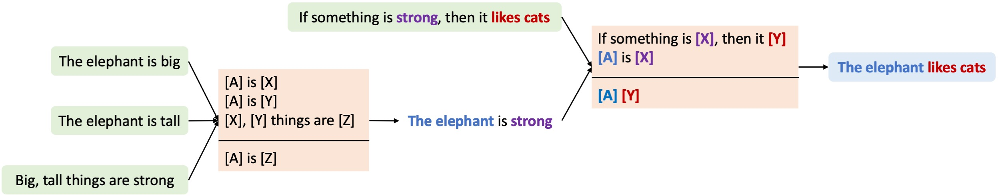

# Learning Symbolic Rules for Reasoning in Quasi-Natural Language



Code for the paper:  

[Learning Symbolic Rules for Reasoning in Quasi-Natural Language](https://arxiv.org/abs/2111.12038)      
Transactions on Machine Learning Research (TMLR), 2023  
[Kaiyu Yang](https://yangky11.github.io/) and [Jia Deng](https://www.cs.princeton.edu/~jiadeng/)     
```bibtex
@article{yang2023metaqnl,
  title={Learning Symbolic Rules for Reasoning in Quasi-Natural Language},
  author={Yang, Kaiyu and Deng, Jia},
  journal={Transactions on Machine Learning Research (TMLR)},
  year={2023},
}
```


## Requirements

1. [1.3 <= Julia < nightly](https://julialang.org/).
1. Install the Julia packages in [Project.toml](./Project.toml): `julia --project=. -e 'import Pkg; Pkg.instantiate()'`.
1. Install the [Open-WBO](http://sat.inesc-id.pt/open-wbo/) MAX-SAT solver. This step is not necessary if you want to use only Z3. But some of our experiments use OpenWBO since it can be faster in certain cases. 


## Documentation

`julia --project=. --color=yes docs/make.jl` will build the documentation at `docs/build/`.


## Training

Use [scripts/train.jl](scripts/train.jl) for training. Datasets will be downloaded automatically. Run `julia --project=. scripts/train.jl --help` for command line options.


## Experiments on MiniSCAN
```bash
julia --project=. scripts/train.jl --dataset MiniSCAN --weight-candidate 0.4 --weight-existing 0.3 --maxsat-solver Z3
```

## Experiments on SCAN

The `simple` split:
```bash
julia --project=. scripts/train.jl --dataset SCAN --split simple --num-train-examples 400 --weight-candidate 0.15 --weight-existing 0.15 --maxsat-solver Z3
```

The `length` split:
```bash
julia --project=. scripts/train.jl --dataset SCAN --split length --num-train-examples 400 --weight-candidate 0.15 --weight-existing 0.15 --maxsat-solver Z3
```

The `addprim_jump` split:
```bash
julia --project=. scripts/train.jl --dataset SCAN --split addprim_jump --num-train-examples 400 --weight-candidate 0.15 --weight-existing 0.15 --maxsat-solver Z3
```

The `addprim_turn_left` split:
```bash
julia --project=. scripts/train.jl --dataset SCAN --split addprim_turn_left --num-train-examples 400 --weight-candidate 0.15 --weight-existing 0.15 --maxsat-solver Z3
```


## Experiments on RuleTaker
```bash
julia --project=. scripts/train.jl --dataset RuleTaker --split depth-1 --num-train-examples 10000 --weight-candidate 0.5 --weight-existing 0.5 --maxsat-solver Z3
julia --project=. scripts/train.jl --dataset RuleTaker --split depth-3 --num-train-examples 10000 --weight-candidate 0.25 --weight-existing 0.25 --maxsat-solver Z3 --lambda-provable 1.28 --lambda-unprovable 1.28
```

## Experiments on SIGMORPHON 2018:
```bash
julia --project=. scripts/train.jl --dataset Sigmorphon --lang spanish --split hard --copy 0 --weight-candidate 1.0 --weight-existing 1.0 --num-epochs 8
```
